# AGA_BackEnd

---

## 😎 Member 😎

| 오하빈                                                  | 최재성                                            |
|------------------------------------------------------|------------------------------------------------|
|  |  |
| 담당 기능                                                | 담당 기능                                               |
| User, Weather, CI/CD                                 | Team, Alarm, Alarm Detail                      |

| 공통 개발                                       |
|------------------------------------------------|
| Team Member, Wakeup, Swagger, 서버 구축, DB 설계 및 관리 |

오하빈 : https://github.com/HABINOH  
최재성 : https://github.com/choe-jaeseong

---

## 🦾 기술 스택 🦾
|||||
|---|--|-|-|
|||||

---

## 📌개발 환경📌

#### 버전
- SpringBoot 3.1.6
- JDK 17
- Mysql 8.0.33
- Ubuntu 22.04.3 LTS
- Docker 24.0.5
#### 관리
- Github, IntelliJ

---

## 📢 DB 요구사항 📢

1. 유저는 UserID로 구분한다.
2. 유저는 여러 팀에 속할 수 있다.
3. 유저는 팀마다 권한을 부여 받을 수 있다. (팀장, 팀원)
4. 팀은 TeamID로 구분한다.
5. 팀 별로 팀 알람과 유저 개인 알람을 설정할 수 있다.
6. 팀 알람과 개인 알람은 여러 개 설정할 수 있다.
7. 각 알람마다 기상여부를 기록할 수 있다.
8. 기상 성공 여부를 반환할 수 있다.
9. 날씨 정보를 기상청 API를 통해 저장 할 수있다.

---

## 📃 DB 설계 📃

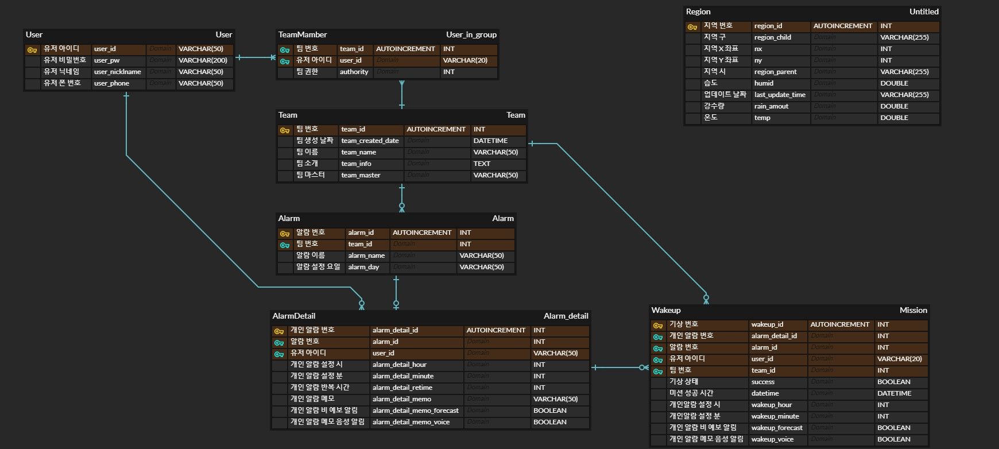

---

## 🚗 Back-End 동작 흐름 🚗

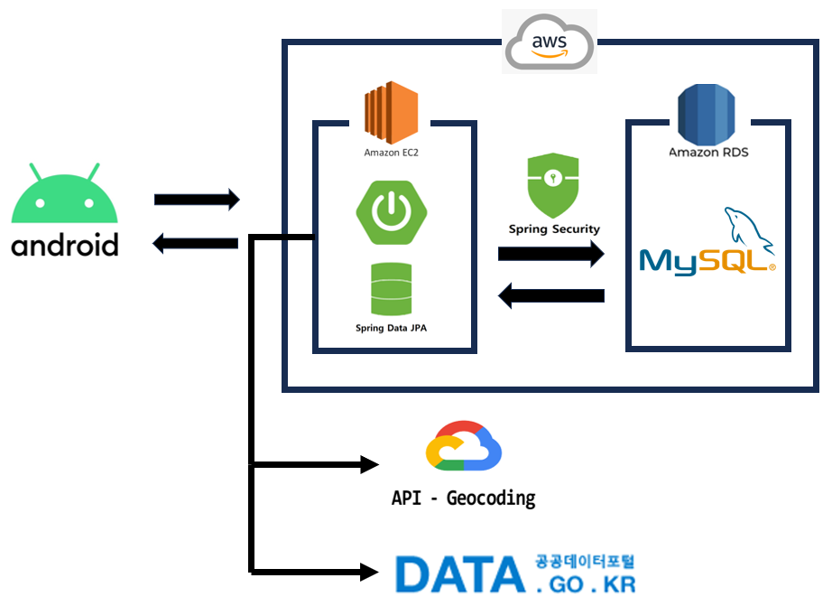

---

## 🚗 Back-End 내부 동작 흐름 🚗

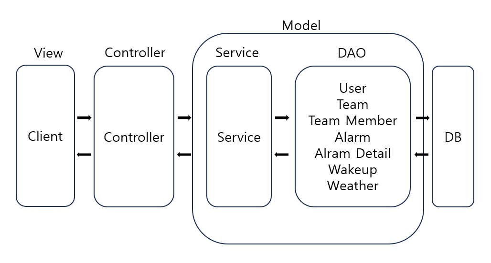

---

## 🚗 Back-End 배포 동작 과정 🚗

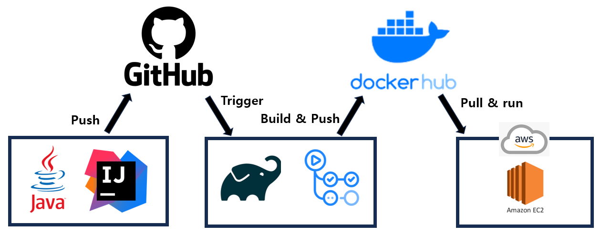

---

## ✨기능✨

### 1. User
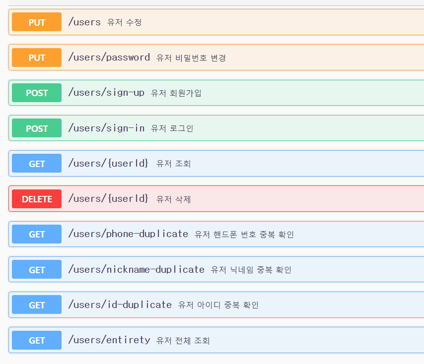

### 2. Team
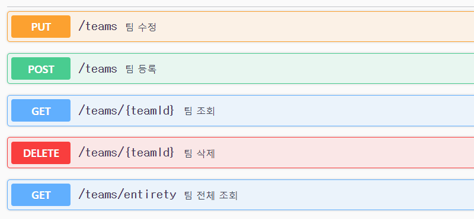

### 3. Team Member
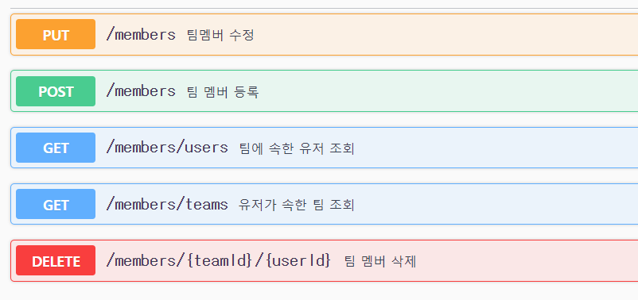

### 4. Alarm
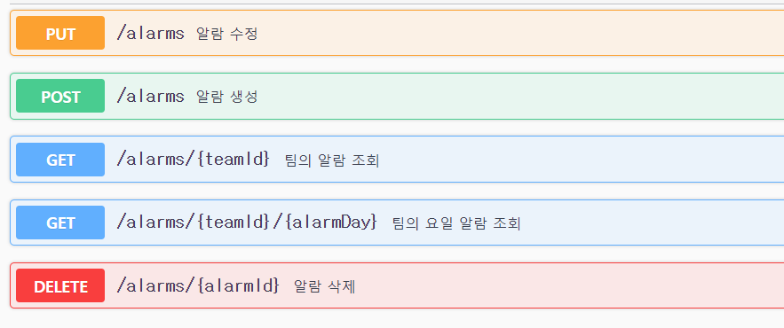

### 5. Alarm Detail
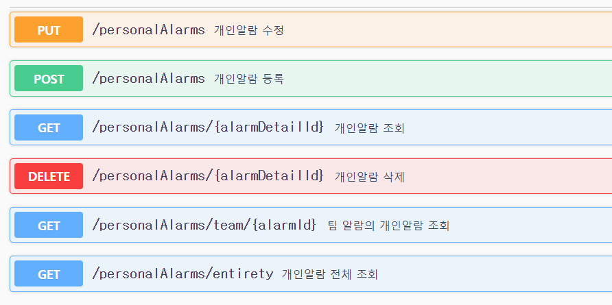

### 6. Wakeup
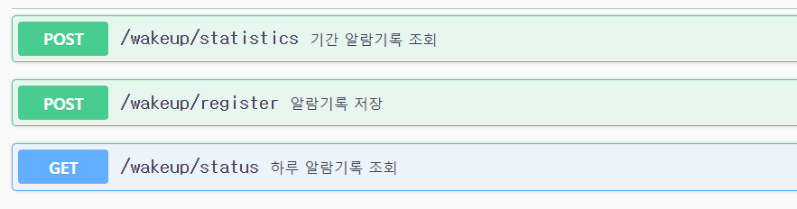

### 7. Weather
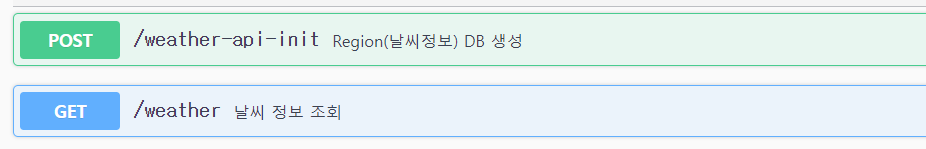

---

## 💘회고💘
| 오하빈        | 최재성 |
|------------|-----|
| 힘들었다..  | 나도..|

